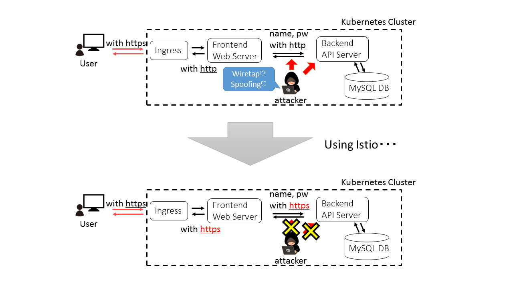

# Security Test Samples

English version is [here](./README_en.md)

## 概要

このリポジトリではKubernetesとIstioを使用する場合の基本的なセキュリティ機能を解説するためのサンプルアプリを提供しています。  
このリポジトリには大きく分けて以下の二つのdemoが含まれています。

- **RBAC Demo**

    RBAC DemoはIstio RBACをどのように使えばいいのかというサンプルデモです。  
    詳細は[demos/rbac](demos/rbac/README.md)にあります。  
    \*) このデモは[Cloud Native Days Tokyo 2019](https://cloudnativedays.jp/cndt2019/)で使用しました。

- **Attack Demo**

    Attack DemoはKubernetesを使用する際にどういった攻撃が考えられてどうすればその攻撃から守れるのかというDemoです。
    詳細は[demos/attack](demos/attack/README.md)にあります。

    1. 盗聴  
        攻撃者がクラスタ内の通信の盗聴しようとします
    2. なりすまし(パスワードが漏洩した場合)  
        attacker try to get secret information by using password.
    3. より悪い状態でのなりすまし(パスワードと証明書が漏洩した場合)  
        attacker try to get secret information by using password and Istio certificate.

    

    \*) このデモは[Open Source Summit Japan 2018](https://events.linuxfoundation.jp/events/open-source-summit-japan-2018/)で使用しました。
    発表スライドは[Speaker Deck](https://speakerdeck.com/smiyoshi/advanced-security-on-kubernetes-with-istio)にあります。

## 事前準備

このアプリではIstioとIngress Controllerを使用します。  
Ingress Controllerを必要とする理由はIstioを使用しないでアプリを立ち上げる場合にIngressリソースを使って外からアクセスできるようにしているためです。

- Istioのインストール
  - [公式ページ](https://istio.io/docs/setup/kubernetes/quick-start/)を参考にインストールしてください。
  - もしくは、`sectest`内にあるインストールスクリプトを使用しても構いません
    - git clone [https://github.com/sh-miyoshi/sectest.git](https://github.com/sh-miyoshi/sectest.git) (このリポジトリをクローンする)
    - cd system
    - vi helm_values.yaml (必要であれば)
    - ./install-istio.sh

- Ingress Controllerのインストール
  - 各プロバイダー(GKE, AKS, EKS, ...)のマネージドサービスを利用すればいいです
  - もしくは、Local上に以下の手順でNginx Ingress Controllerを作成します
    - kubectl apply -f system/ingress-controller-nginx.yaml

## サンプルアプリのデプロイ手順(Istioなし)

1. デプロイ手順

    ```bash
    # secretファイルの作成
    cd kubernetes
    ./make_secret.sh

    # アプリのデプロイ
    kubectl apply -f .
    * access to https://<ingress-controller-address>

    # アプリの動作確認
    # ブラウザ上でユーザ名とパスワードを入力すると、秘密のメッセージを取得できます
    # User: "root"
    # Password: "ossj_sectest"
    ```

2. 削除手順

    ```bash
    cd kubernetes
    kubectl delete -f .
    ```

## サンプルアプリのデプロイ手順(Istioあり)
