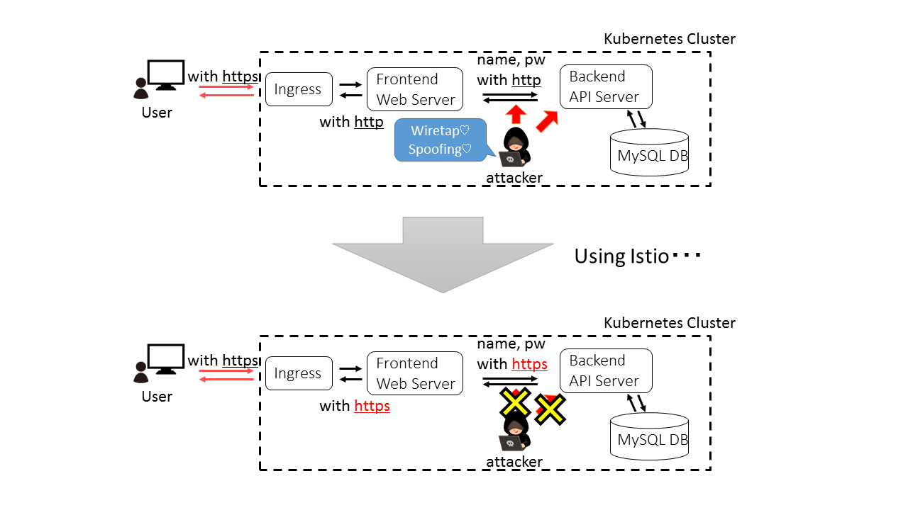

# Security Test Samples

## Overview

`sectest` is a set of security demos.  
This repository includes topics of security in Kubernetes and Istio.

## Attack Demo

`attack_demo` is a demo of basic security in Kubernetes and Istio.
This directory includes what problem are there in a service on Kubernetes, and how to protect by Istio.  
Attack: Wiretap, Spoofing, Worse Case Spoofing

